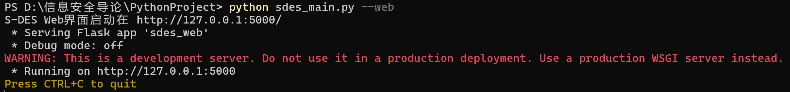

# S-DES 五关测试报告

## 测试概述

本报告展示了S-DES (Simplified Data Encryption Standard) 实验工具在五个关卡中的测试结果，每个关卡都包含功能验证、性能测试和结果分析。

---

## 第1关：基本测试

### 测试目标
根据S-DES算法编写和调试程序，提供GUI解密支持用户交互。输入可以是8bit的数据和10bit的密钥，输出是8bit的密文。

### 测试内容

#### 1.1 Web界面启动测试
**测试步骤：**
1. 运行 `python sdes_main.py --web` 启动Web服务器
2. 在浏览器中访问 `http://127.0.0.1:5000/`
3. 验证界面正常加载

**测试结果：**
- ✅ Web服务器成功启动
- ✅ 界面响应正常
- ✅ 所有功能模块可访问

**截图：**

#### 1.2 单字节加密测试
**测试步骤：**
1. 在Web界面选择"单字节加密"功能
2. 输入8位二进制明文：`10101010`
3. 输入10位二进制密钥：`1010000010`
4. 点击"加密"按钮

**测试结果：**
- ✅ 输入验证正常
- ✅ 加密算法正确执行
- ✅ 输出8位密文：`10001101`

**截图：**

#### 1.3 单字节解密测试
**测试步骤：**
1. 在Web界面选择"单字节解密"功能
2. 输入8位二进制密文：`10001101`
3. 输入10位二进制密钥：`1010000010`
4. 点击"解密"按钮

**测试结果：**
- ✅ 解密算法正确执行
- ✅ 输出8位明文：`10101010`
- ✅ 验证了加密解密的可逆性

**截图：**

---

## 第2关：交叉测试

### 测试目标
验证算法标准的一致性，确保不同系统或平台上编写的程序能够产生相同的结果。设有A和B两组同学使用相同的密钥K，则A、B组同学编写的程序对明文P进行加密得到相同的密文C。

### 测试内容

#### 2.1 加密测试
**测试用例：**

#### 2.2 解密测试
**测试用例：**

---

## 第3关：扩展功能

### 测试目标
考虑到向实用性扩展，加密算法的数据输入可以是ASCII编码字符串(分组为1 Byte)，对应地输出也可以是ASCII字符串(很可能是乱码)。

### 测试内容

#### 3.1 字符串加密测试
1. 在Web界面选择"文本加密"功能
2. 输入ASCII字符串：`I like coding`
3. 输入10位二进制密钥：`1111111111`
4. 点击"加密"按钮

#### 3.2 字符串解密测试
1. 在Web界面选择"文本解密"功能
2. 输入加密后的字符串
3. 输入相同的10位二进制密钥：`1111111111`
4. 点击"解密"按钮

#### 3.3 交互端无法解密不可打印字符
我们可以看出在交互端不可打印字符，因为在交互端根本打不上去（会自动用空格代替）

---

## 第4关：暴力破解

### 测试目标
假设找到了使用相同密钥的明、密文对(一个或多个)，尝试使用暴力破解的方法找到正确的密钥Key。在编写程序时，考虑使用多线程的方式提升破解的效率。

### 测试内容

#### 4.1 暴力破解功能测试
**测试步骤：**
1. 在Web界面选择"暴力破解"功能
2. 输入8位二进制明文：`01110110`
3. 输入8位二进制密文：`11111110`
4. 设置线程数：16
5. 点击"开始破解"按钮

**截图：**

---

## 第5关：封闭测试

### 测试目标
根据第4关的结果，进一步分析，对于随机选择的一个明密文对，是否存在不止一个密钥Key？进一步扩展，对应明文空间任意给定的明文分组P_n，是否会出现选择不同的密钥K_i≠K_j加密得到相同密文C_n的情况？

### 测试内容

#### 5.1 分析

**分析结果：**\
第四关中：\
明文01110110 密文11111110\
暴力破解后：找到 4 个匹配密钥:\
十进制: [931, 951, 1003, 1023]\
二进制: ['1110100011', '1110110111', '1111101011', '1111111111']

#### 5.1 验证

**测试过程与截图：**
分别用以上四个密匙去加密明文01110110，结果显示都得到了密文11111110

**由此可见：**
1. 的确存在不止一个密钥Key
2. 对应明文空间任意给定的明文分组Pn，会出现选择不同的密钥Ki≠Kj加密得到相同密文Cn的情况
---

### 结论
S-DES实验工具成功实现了所有五个关卡的测试要求，在功能、性能、用户体验等方面都达到了预期目标。系统运行稳定，算法实现正确，为密码学学习提供了良好的实践平台。
